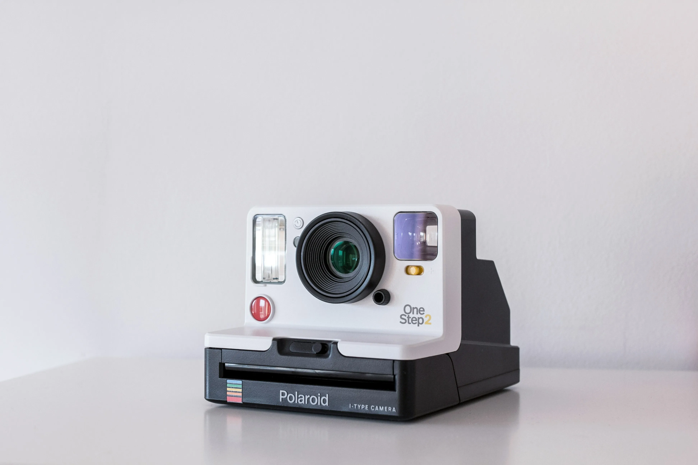
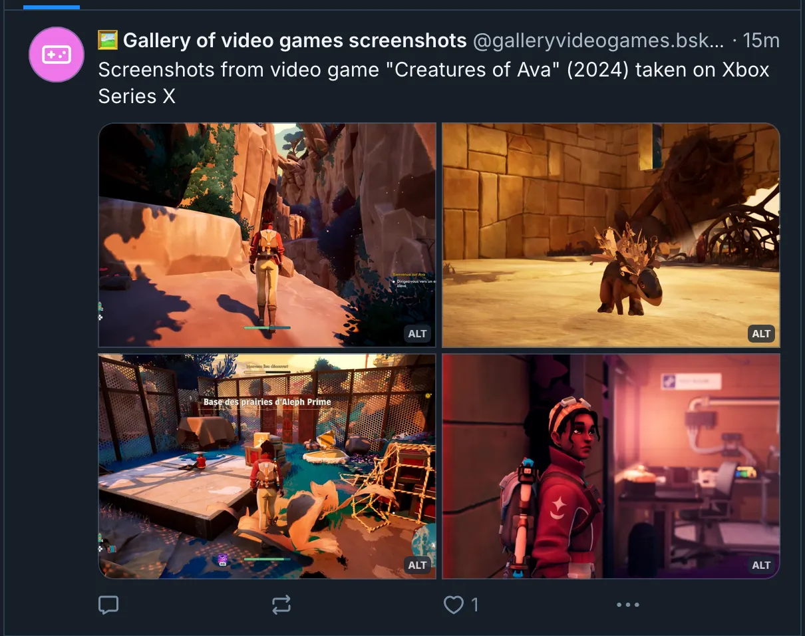

<h1 align="center">
  
</h1>

# autophoto

<h4 align="center">An application to automatically publish your photos</h4>

<p align="center">
  
  
</p>

<p align="center">
  <a href="#key-features">Key Features</a> •
  <a href="#how-to-use">How To Use</a> •
  <a href="#contributing">Contributing</a> •
  <a href="#credits">Credits</a> •
  <a href="#authors">Authors</a> •
  <a href="#license">License</a> •
  <a href="#projects-using-autophoto">Projects using autophoto</a> •
  <a href="#changelog">Changelog</a>
</p>



## Key Features

* Publish photos (or images) to a remote server
  - Only supports Bluesky
  - Randomly select 4 photos and publish them
* Pre-scan your directories for photos
  - Photos are detected by a path pattern
  - Check all detected photos if they are valid (for instance BlueSky has size limitations)
* Scan your directory for photos
  - For now only suppose to work with video game screenshots
  - Photos are detected by a path pattern
  - Save them into a file database
* Publish database statistics
* Application is build as native desktop app
  - CLI based

## How To Use

Find the latest release [here](https://github.com/Zhykos/autophoto/releases).
Download the latest release for your platform and run the executable.

### Scan directories to save photos in a database

#### Configuration file

First, you need to configure the application to scan your directory for photos with a YAML configuration file.

Example configuration file:

```yaml
autophoto:
  scan:
    - directory: ./test/resources/video-game
      type: video-game
      data-pattern:
        regex: '^(.+) \((\d{4})\)/(.+)/.+\.webp$'
        groups:
          - title
          - release-year
          - platform
```

As you can scan multiple directories, you can add multiple `scan` entries.

A `scan` entry has the following properties:
- `directory`: The directory to scan for photos
- `type`: The type of photos to scan for (V1 only supports `video-game`)
- `data-pattern`: The pattern to extract data from the photo path
  - `regex`: The regex to match the photo path
  - `groups`: The groups to extract from the regex (only the following groups are supported for now: `title`, `release-year`, `platform`)

In the example above, the application will scan the `./test/resources/video-game` directory for photos with the following path pattern:
`{video game title} ({release-year})/{platform}/photo-name.webp`

#### Run the application to pre-scan your directories (check)

Once you have your configuration file, you can run the application with the configuration file as argument: :

```shell
autophoto --prescan=./path/to/your/configuration-file.yaml
```

You'll see the detected photos and if they are valid or not in the console.

#### Run the application to scan your directories

Once you have your configuration file, you can run the application with the configuration file as argument: :

```shell
autophoto --scan=./path/to/your/configuration-file.yaml
```

The scanned data are stored in a SQLite database in the `db.autophoto.sqlite3` file.

### Publish your photos on Bluesky

You need a Bluesky account to publish your photos: [Bluesky](https://bsky.app/).

Then run the application with the `--publish` option and your mandatory Bluesky credentials:

```shell
autophoto --publish --bluesky_login=your_login --bluesky_password=your_password
```

Optionnally, you can also specify the Bluesky URL with the `--bluesky_host` option:

```shell
autophoto --publish --bluesky_login=your_login --bluesky_password=your_password --bluesky_host=https://bsky.app
```

### Publish statistics (about your gallery) on Bluesky

You need a Bluesky account to publish statistics: [Bluesky](https://bsky.app/).

Then run the application with the `--stats` option and your mandatory Bluesky credentials:

```shell
autophoto --stats --bluesky_login=your_login --bluesky_password=your_password
```

Optionnally, you can also specify the Bluesky URL with the `--bluesky_host` option:

```shell
autophoto --stats --bluesky_login=your_login --bluesky_password=your_password --bluesky_host=https://bsky.app
```

### Command line options and arguments for autophoto

For all actions (pre-scan, publish scan or stats), you can set other options in the command line.

#### Specify where the database file is stored (to be written for scan or read for publish)

You can specify the path to the database file with the `--database` option:

```shell
autophoto --scan=./path/to/your/configuration-file.yaml --database=./path/to/your/database-file.sqlite3
```

This option is not used for the pre-scan action.

#### Debug mode

You also activate the debug mode with the `--debug` option:
* When scanning, this will print the video games and photos detected.
* When pusblishing, this will print the photos published.

Example:

```shell
autophoto --publish --bluesky_login=your_login --bluesky_password=your_password --debug
```

#### Change the logger style

You can change the logger style with the `--logger` option:

```shell
autophoto --scan=./path/to/your/configuration-file.yaml --logger=batch
```

The following styles are available:
- `batch`: print only the essential and raw information
- `console`: print all the information with style and colors

`console` is the default style.

## Contributing

### Install the project

#### Deno

Deno is a runtime for JavaScript and TypeScript that is based on the V8 JavaScript engine and the Rust programming language.

You need to install Deno to run the project: https://docs.deno.com/runtime/getting_started/installation/.

#### Lint and format

Activate the linter and formater with Biome:

```shell
deno add npm:@biomejs/biome@1.9.4
deno install --allow-scripts=npm:@biomejs/biome@1.9.4
```

You'll be able to run the lint with the following command (Deno linter and Biome linter will be executed):

```shell
deno task lint
```

You'll be able to run the format with the following command (only use Biome formatter):

```shell
deno task format
```

#### Git hooks

You can install the git hooks with the following command:

```shell
deno task hook install
```

It will run the linter and tests before each commit.

### Run the project

There is no run configuration for the project because I just used unit tests to develop the project.

However you can execute a scan with the following command:

```shell
deno task e2e:scan
```

It will use the configuration files `config.yml` and `./test/resources/config2.yml`.

You can execute a publish with the following command:

```shell
LOGIN=your_login PASSWORD=your_password deno task e2e:publish
```

### Run the tests

You can run the unit tests with the following command:

```shell
deno task test
```

You can run the coverage with the following command:

```shell
deno task coverage
```

It will generate a coverage report in the `coverage` directory and open it in your browser.

### Contribute

You can optionnally create an issue to describe a new feature, a bug or something else.

Then create a Pull Request (see non existing yet CONTRIBUTING.md file).

## Credits

This software uses the following open source packages:

- Deno 2: [JavaScript runtime](https://deno.com/)
- Biome: [Lint and format](https://biomejs.dev/)
- JavaScript Standards: [jsr.io](https://jsr.io/@std)
- To publish on Bluesky: [atproto - For Bluesky](https://atproto.com/)
- Multiformats library: [Multiformats](https://multiformats.io/)
- Git hook: [Hook](https://deno.land/x/deno_hooks)
- README template by [Amit Merchant](https://github.com/amitmerchant1990)
- I wish to not generate a header with IA so I used an image by <a href="https://unsplash.com/fr/@enikoo">eniko kis</a> on <a href="https://unsplash.com/fr/photos/appareil-photo-instantane-polaroid-one-step-2-blanc-et-noir-sur-tableau-blanc-KsLPTsYaqIQ">Unsplash</a>

## Authors

- **Thomas Cicognani** - *Original creator* - [Zhykos](https://github.com/Zhykos)
- **Andrea Valentini** - *Contributor* - [AndreVale69](https://github.com/AndreVale69)

## License

[MIT](https://opensource.org/license/MIT)

## Projects using autophoto

- [🖼️ Gallery of video games screenshots: more than 10.000 photos](https://bsky.app/profile/galleryvideogames.bsky.social)

---

This project is also a space to learn and experiment with Deno, TypeScript, DDD and TDD.
So, if you have any suggestions, questions or want to chat, feel free to contact me.
Some things already need to be improved, like the error handling, the architecture,
the domains, the performance, etc. So, if you want to help me, I will be happy to work with you.

> [zhykos.fr](https://www.zhykos.fr) &nbsp;&middot;&nbsp;
> GitHub [@zhykos](https://github.com/Zhykos) &nbsp;&middot;&nbsp;
> Bluesky [@zhykos](https://bsky.app/profile/zhykos.fr)

---

## Changelog

* 1.0.0
  - Initial release
* Forgot to add the changelog
* 2.1.0
  - Remove the pick priority of directories which have at least 4 photos to publish
* 2.2.0
  - Fix number formats in logs (thanks to @AndreVale69)
  - Add a logger style option (batch or console)
  - Check PRs with GitHub Actions
* 2.3.0
  - Add "PlayStation 4 (demo)" platform
* 2.4.0
  - Add "Xbox One (beta)" platform
  - New CLI option to publish statistics
* 2.5.0
  - Add "Nintendo Switch (demo)" platform
